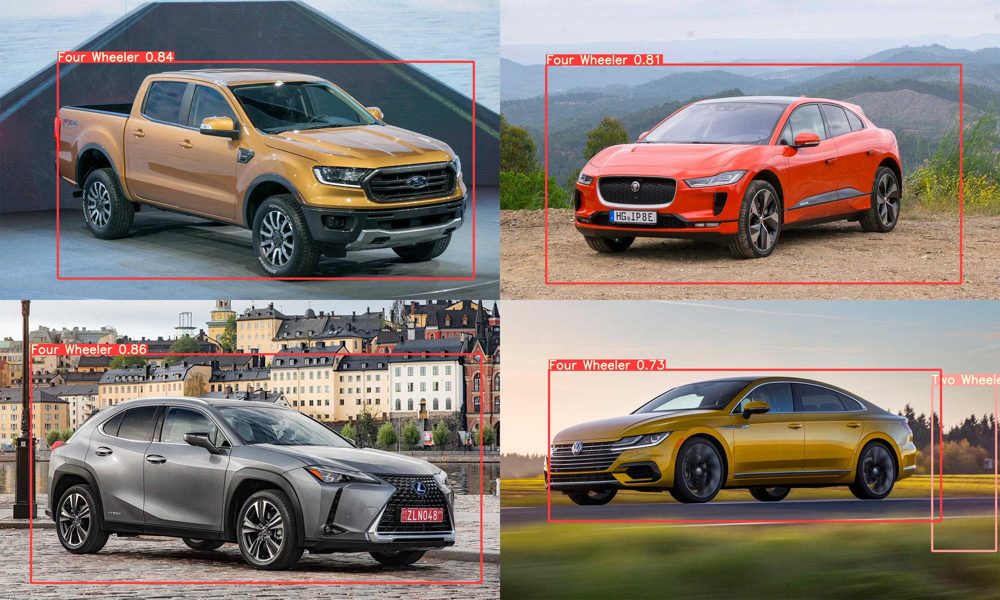

# Object-Detection-Using-YoloV5

Reference 1 : https://www.datascience2000.in/2021/06/object-detection-using-yolov5-part-1.html

Refrence 2 : https://www.datascience2000.in/2021/06/object-detection-using-yolov5-part-2.html

Download dataset : https://drive.google.com/drive/folders/1U962g4vqOPdCsJBoij5Fl9Ys4b8DT-5R?usp=sharing

 
 

<h1>Test image</h1>

<h2>YoloV5</h2>
